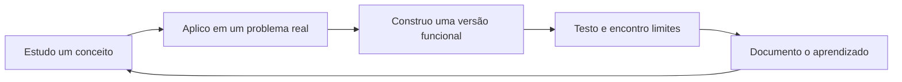

<div align="center">
  

  <h1>Eduardo Faé Zanchet</h1>

  <p><strong>Transformo o que estudo em software que funciona, pode ser testado e é fácil de explicar.</strong></p>

  <p>
    Estudante de Ciência da Computação na UPF · C++ · PostgreSQL · Desenvolvimento de Software
  </p>

  <p>
    <a href="https://eduardofae210.github.io/portfolio-pessoal-v2/"><strong>Portfólio</strong></a>
    &nbsp;·&nbsp;
    <a href="https://www.linkedin.com/in/eduardofaezanchet/"><strong>LinkedIn</strong></a>
    &nbsp;·&nbsp;
    <a href="mailto:eduardofae21@gmail.com"><strong>Contato</strong></a>
  </p>
</div>

---

## `> whoami`

Sou estudante do **2º semestre de Ciência da Computação na Universidade de Passo Fundo (UPF)**. Minha forma favorita de aprender é construir: cada novo conceito vira uma funcionalidade, cada exercício vira repertório e cada projeto registra uma etapa real da minha evolução.

Hoje, concentro meus estudos em **C++**, **algoritmos**, **modelagem de dados**, **SQL** e **PostgreSQL**. Também tenho experiência prática com suporte de TI, hardware e desenvolvimento web.

```text
LOCALIZAÇÃO    Passo Fundo, RS, Brasil
FOCO ATUAL     C++ · Algoritmos · SQL · PostgreSQL
MÉTODO         Aprender → Construir → Testar → Documentar
OBJETIVO       Primeira oportunidade de estágio em Tecnologia
```

## Em construção

### AlgoTrack — transformar estudo em dados

Meu próximo projeto será uma aplicação em **C++ + PostgreSQL** para registrar exercícios de programação, analisar tentativas, identificar conteúdos com maior dificuldade e recomendar o próximo assunto a praticar.

O projeto nasce de um problema real do meu dia a dia e conecta os conteúdos que estou estudando agora: funções, vetores, matrizes, `struct`, ordenação, modelagem relacional, `JOIN`, agregações, `GROUP BY` e `HAVING`.

> Status: **planejamento do produto e da arquitetura**.

## Projetos que contam minha evolução

<table>
  <tr>
    <td width="50%" valign="top">
      <h3><a href="https://github.com/EduardoFae210/tech-store-system">Tech Store System</a></h3>
      <p>Sistema de gerenciamento de uma loja de informática com aplicação em C++, banco PostgreSQL e protótipo web.</p>
      <p><strong>Destaques:</strong> vendas com múltiplos itens, validação e atualização de estoque, busca, ordenação, modelagem relacional e consultas SQL.</p>
      <p><code>C++</code> <code>PostgreSQL</code> <code>SQL</code> <code>HTML</code> <code>CSS</code> <code>JavaScript</code></p>
    </td>
    <td width="50%" valign="top">
      <h3><a href="https://github.com/EduardoFae210/inventario-ti-cpp">Inventário de TI</a></h3>
      <p>Aplicação de terminal para organizar equipamentos de TI e praticar fundamentos de programação com um contexto próximo da rotina de suporte.</p>
      <p><strong>Destaques:</strong> cadastro, busca, filtros, atualização de status, validação de entradas e organização em funções.</p>
      <p><code>C++</code> <code>CLI</code> <code>Algoritmos</code> <code>Arrays</code></p>
    </td>
  </tr>
  <tr>
    <td width="50%" valign="top">
      <h3><a href="https://github.com/EduardoFae210/job-tracker-python">Job Tracker</a></h3>
      <p>Aplicação CLI criada para acompanhar candidaturas, centralizar informações e tornar a busca por oportunidades mais organizada.</p>
      <p><strong>Destaques:</strong> CRUD, persistência em SQLite, exportação CSV e testes automatizados.</p>
      <p><code>Python</code> <code>SQLite</code> <code>CRUD</code> <code>unittest</code></p>
    </td>
    <td width="50%" valign="top">
      <h3><a href="https://github.com/EduardoFae210/portfolio-pessoal-v2">Portfólio Pessoal</a></h3>
      <p>Experiência web responsiva que apresenta minha trajetória, meus projetos e as tecnologias que fazem parte da minha formação.</p>
      <p><strong>Destaques:</strong> design responsivo, modo claro/escuro e publicação contínua pelo GitHub Pages.</p>
      <p><code>HTML</code> <code>CSS</code> <code>JavaScript</code> <code>GitHub Pages</code></p>
    </td>
  </tr>
</table>

## Toolbox

<div align="center">


</div>

## Como eu construo



Não uso meus repositórios apenas como armazenamento de código. Quero que cada um mostre **o problema**, **as decisões**, **o que já funciona** e **o próximo passo**.

## Além do código

- Experiência prática com montagem e manutenção de computadores, Windows, drivers, BIOS/UEFI e diagnóstico básico.
- Inglês intermediário-avançado para leitura técnica, documentação e comunicação.
- Interesse em suporte, desenvolvimento de software, dados e resolução estruturada de problemas.
- Disponibilidade para estágio presencial em Passo Fundo ou remoto.

---

<div align="center">
  <strong>Aprender. Construir. Explicar. Evoluir.</strong>
  <br />
  <sub>Se algum projeto chamou sua atenção, vamos conversar.</sub>
</div>
